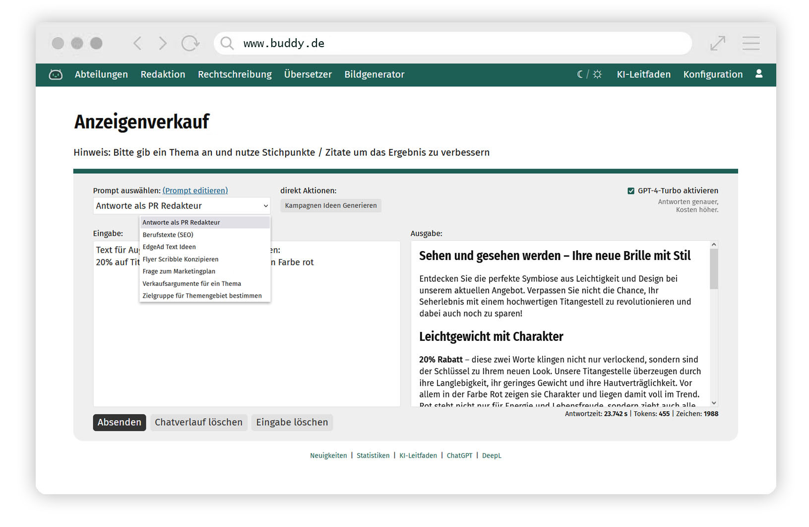

# GPT | Buddy
Prompt Management System for Interaction with the ChatGPT API

## Latest News
Important Information for the Prompt Temperatures Update from 2023-12-17
The Update requires a new field in the prompt database called "temperatures", varchar(64) and null.
As always before updating: rember to save your config.php, custom.css, main-nav.tpl and faq.tpl!!!

## Features
Configurable Prompt Database including lots of examples
Interactive Text generation based on predefined prompts with ChatGPT
Fileuploads with Audiotranscribtion based on OpenAI Whisper
AI Image generation via Dall-E3
Integrated User- and Rights-Management System
Detailed prompt usage statistics to identify workflows for your Company

## Demonstration
For Demonstration purposes please contact stuff@artmessengers.de
More information on: https://www.artmessengers.de/buddy/buddy-features.pdf

## Requirements
External OpenAI account (https://platform.openai.com)
Webserver with PHP8 and MySQL Database
preferably Composer

## Installation
1. Important: Before you start you have to rename 5 Files:
   example.env -> **.env**
   example.buddy-config.php -> **buddy-config.php**
   app/config/example.config.php -> **config.php**
   app/templates/navigation/example.main-nav.tpl -> **main-nav.tpl**
   app/templates/example.faq.tpl -> **faq.tpl**
   public/styles/css/example.custom.css -> **custom.css**
3. Add your Database credentials and the OpenAI-API Key (https://platform.openai.com) to your buddy-config.php File. Database creds and config have to be added to the `.env` file aswell
4. Optionally, in the buddy-config.php file you can setup an SMTP-E-Mail Server (used for Password recovery) or define IP-Ranges that do not require Logins e.g. for Intranet Usage
5. Import the Prompt Database (supplied externally) into your Database (e.g. with PHP My Admin)
6. run "composer install"

### Docker setup
As an alternative a docker-compose.yaml file is provided. This requires to only have docker-desktop  installed.
Additional steps:
1. Start containers using `docker compose up -d`
2. Copy Database dump to database container with `docker compose cp [DB_DUMP].sql mariadb:/db.sql`
3. Import Database Dump, entering the root password set in the `.env`-file with `docker compose exec mariadb sh -c "mariadb -u root -p bnn-buddy < db.sql"`

To use this in production a few steps are necessary:
1. Remove DB, can be done separately
2. Make sure PHPOPcache etc. is correctly included and configured
3. Use production ready php.ini file, which the container already provides.

## Configuration
In the config.php File you can setup Categories which you can use to seperate your Prompts into groups e.G. Editorial, Support, Sales.
Prompt-Categories can be accessed like this: www.buddy.com/categoryname
You should setup your navigation (app/tamples/navigation/main-nav.tpl) according to your Prompt-Categories

## Customization
You can change CSS in you custom.css File (public/styles/css/custom.css)
Uncomment the :root Variables and change the colors to your liking e.g. blue --primary: #4585c4;
